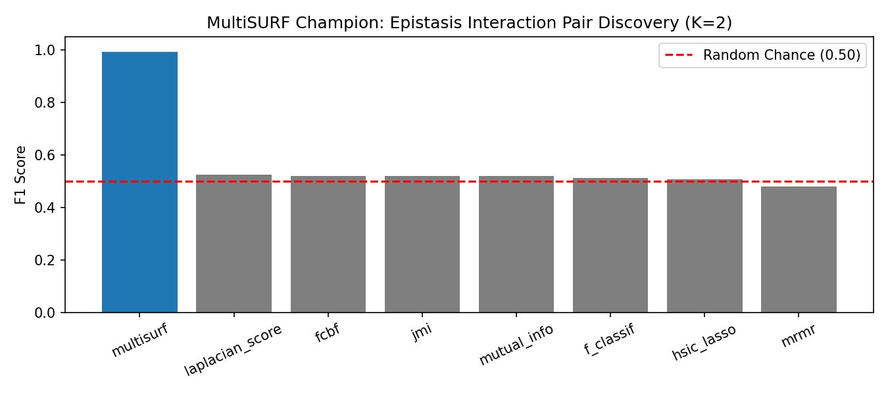
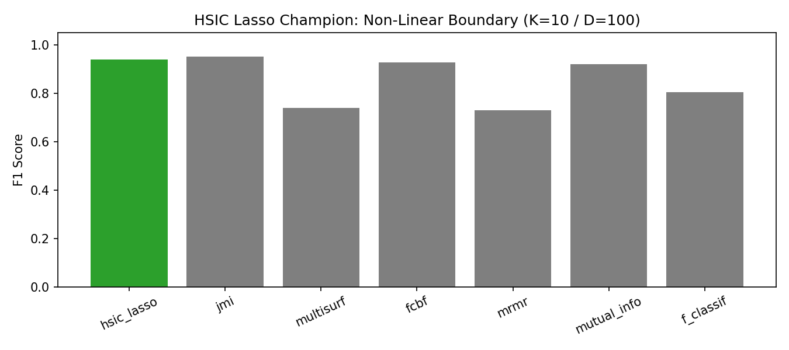
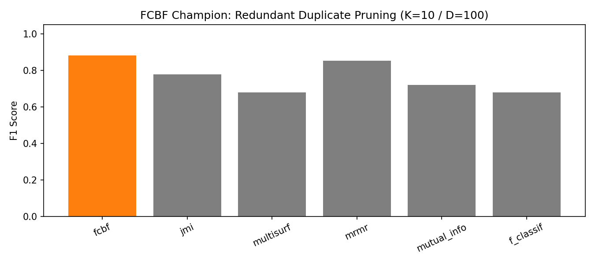
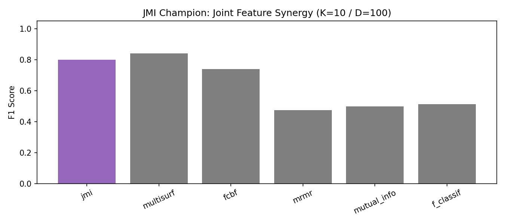

# Feature Selection

`scikit-lego` offers a comprehensive suite of advanced feature selection algorithms extending standard `scikit-learn` capabilities. All selectors inherit from `SelectorMixin` and `BaseEstimator`, making them fully compatible with `Pipeline` and `ColumnTransformer`.

---

## Maximum Relevance Minimum Redundancy (MRMR)

!!! info "New in version 0.8.0"

The [`Maximum Relevance Minimum Redundancy`][MaximumRelevanceMinimumRedundancy-api] (MRMR) is an iterative feature selection method commonly used in data science to select a subset of features from a larger feature set. The goal of MRMR is to choose features that have high *relevance* to the target variable while minimizing *redundancy* among the already selected features.

**Reference & Paper:**
- Hanchuan Peng, Fuhui Long, and Chris Ding. *"Feature selection based on mutual information: criteria of max-dependency, max-relevance, and min-redundancy."* IEEE Transactions on Pattern Analysis and Machine Intelligence.

MRMR is heavily dependent on the two functions used to determine relevance and redundancy. The default scikit-lego implementation uses [f_classif](https://scikit-learn.org/stable/modules/generated/sklearn.feature_selection.f_classif.html) or [f_regression](https://scikit-learn.org/stable/modules/generated/sklearn.feature_selection.f_regression.html) as relevance function and Pearson correlation as redundancy function, but customizable functions can be passed.

```python title="MRMR Example"
from sklego.feature_selection import MaximumRelevanceMinimumRedundancy
from sklearn.datasets import make_classification

X, y = make_classification(n_samples=200, n_features=20, random_state=42)

selector = MaximumRelevanceMinimumRedundancy(k=5, kind="classification")
X_selected = selector.fit_transform(X, y)
print("Selected feature indices:", selector.selected_features_)
```

---

## Joint Mutual Information (JMI)

!!! info "New in version 0.9.10"

The [`JMISelector`][JMISelector-api] implements Joint Mutual Information feature selection based on Brown et al. (JMLR 2012).

**Reference & Paper:**
- Gavin Brown, Adam Pocock, Zhao-Rong Wang, and Mikel Luján. *"Conditional Likelihood Maximisation: A Unifying Framework for Information Theoretic Feature Selection."* Journal of Machine Learning Research (JMLR), 13(27):27-66, 2012.

JMI greedily selects candidate feature $X_c$ that maximizes the joint mutual information with target $Y$ given already-selected features $S$:

$$J_{\text{JMI}}(X_c) = \sum_{X_j \in S} I(X_c, X_j; Y)$$

Using information-theoretic chain rules, JMI balances three components:
1. **Relevancy**: $I(X_c; Y)$ (marginal mutual information with target)
2. **Redundancy**: $I(X_c; X_j)$ (overlap with selected features)
3. **Complementarity**: $I(X_c; X_j \mid Y)$ (synergy revealed when conditioning on target $Y$)

```python title="JMISelector Example"
from sklego.feature_selection import JMISelector
from sklearn.datasets import make_classification

X, y = make_classification(n_samples=200, n_features=20, n_informative=5, random_state=42)

selector = JMISelector(n_features_to_select=5)
X_selected = selector.fit_transform(X, y)
print("Selected feature indices:", selector.selected_features_)
```

---

## Hilbert-Schmidt Independence Criterion Lasso (HSIC Lasso)

!!! info "New in version 0.9.10"

The [`HSICLassoSelector`][HSICLassoSelector-api] implements non-linear feature selection using Hilbert-Schmidt Independence Criterion Lasso (Yamada et al., Neural Computation 2014).

**Reference & Paper:**
- Makoto Yamada, Wataru Uwai, Tomer Levinboim, Seiya Imoto, and Masashi Sugiyama. *"High-Dimensional Feature Selection by Feature-Wise Kernelized Lasso."* Neural Computation, 26(1):185-207, 2014.

HSIC Lasso maps input features and target labels into kernel spaces using Gram matrices ($\bar{K}^{(k)}$ and $\bar{L}$), finding a sparse non-negative linear combination of per-feature kernels that best approximates the target kernel matrix:

$$\min_{\boldsymbol{\alpha} \geq 0} \frac{1}{2} \left\| \bar{L} - \sum_{k=1}^d \alpha_k \bar{K}^{(k)} \right\|_F^2 + \lambda \|\boldsymbol{\alpha}\|_1$$

Because the objective is convex, it guarantees a global optimum without getting trapped in local minima.

```python title="HSICLassoSelector Example"
from sklego.feature_selection import HSICLassoSelector
from sklearn.datasets import make_classification

X, y = make_classification(n_samples=150, n_features=15, random_state=42)

selector = HSICLassoSelector(n_features_to_select=5, lasso_alpha=0.01)
X_selected = selector.fit_transform(X, y)
print("Selected feature indices:", selector.selected_features_)
```

---

## Fast Correlation-Based Filter (FCBF)

!!! info "New in version 0.9.10"

The [`FCBFSelector`][FCBFSelector-api] implements Fast Correlation-Based Filter feature selection (Yu & Liu, ICML 2003).

**Reference & Paper:**
- Lei Yu and Huan Liu. *"Feature Selection for High-Dimensional Data: A Fast Correlation-Based Filter Solution."* Proceedings of the 20th International Conference on Machine Learning (ICML), 2003.

FCBF uses **Symmetrical Uncertainty** (SU) to identify relevant features and prune redundant ones using approximate Markov blankets:

$$\text{SU}(X, Y) = 2 \cdot \frac{I(X; Y)}{H(X) + H(Y)}$$

Feature $F_p$ subsumes candidate $F_q$ if $\text{SU}(F_p, F_q) \ge \text{SU}(F_q, C)$, allowing fast $O(S^2)$ pruning in high-dimensional settings ($D \gg N$).

```python title="FCBFSelector Example"
from sklego.feature_selection import FCBFSelector
from sklearn.datasets import make_classification

X, y = make_classification(n_samples=100, n_features=50, n_informative=10, random_state=42)

# Automatically prune redundant features above threshold
selector = FCBFSelector(threshold=0.01, n_features_to_select=10)
X_selected = selector.fit_transform(X, y)
print("Actual features selected:", selector.n_selected_)
```

---

## Laplacian Score

!!! info "New in version 0.9.10"

The [`LaplacianScoreSelector`][LaplacianScoreSelector-api] provides **unsupervised** graph manifold-preserving feature selection (He et al., NIPS 2005).

**Reference & Paper:**
- Xiaofei He, Deng Cai, and Partha Niyogi. *"Laplacian Score for Feature Selection."* Advances in Neural Information Processing Systems (NIPS), 18:507-514, 2005.


It constructs a $k$-nearest neighbor affinity graph $W$ with heat kernel weights and computes the Rayleigh quotient on the graph Laplacian ($L = D - W$):

$$L_r = \frac{\tilde{f}_r^\top L \tilde{f}_r}{\tilde{f}_r^\top D \tilde{f}_r}$$

Features achieving the smallest scores best preserve local data manifold structure and possess high degree-weighted variance.

```python title="LaplacianScoreSelector Example"
from sklego.feature_selection import LaplacianScoreSelector
from sklearn.datasets import make_blobs

X, _ = make_blobs(n_samples=100, n_features=15, centers=3, random_state=42)

# Unsupervised fit without target y
selector = LaplacianScoreSelector(n_features_to_select=5, n_neighbors=5)
X_selected = selector.fit_transform(X)
print("Selected feature indices:", selector.selected_features_)
```

---

## MultiSURF

!!! info "New in version 0.9.10"

The [`MultiSURFSelector`][MultiSURFSelector-api] implements Relief-based feature selection with adaptive instance-specific distance thresholds (Urbanowicz et al., BioData Mining 2018).

**Reference & Paper:**
- Ryan J. Urbanowicz, Marcos Olmo, Nicholas A. McKinney, Ben M. Zimerman, and Jason H. Moore. *"Benchmarking Relief-Based Feature Selection Methods for Bioinformatics Data Mining."* BioData Mining, 11(16), 2018.


For each instance $R_i$, MultiSURF dynamically computes a near-neighborhood threshold $T_{\text{near}}(i) = \mu(d_i) - \frac{\sigma(d_i)}{2}$, evaluating feature value differences against near hits and near misses. This enables MultiSURF to detect high-order non-linear feature interactions (such as XOR/epistasis) without explicit combinatorial searches.

```python title="MultiSURFSelector Example"
import numpy as np
from sklego.feature_selection import MultiSURFSelector

# Synthetic XOR interaction
rng = np.random.RandomState(42)
X = rng.binomial(1, 0.5, size=(200, 10)).astype(float)
y = np.logical_xor(X[:, 0] > 0.5, X[:, 1] > 0.5).astype(int)

selector = MultiSURFSelector(n_features_to_select=2)
X_selected = selector.fit_transform(X, y)
print("Top 2 selected features (expected [0, 1]):", selector.selected_features_)
```

---

## Benchmark Suite across Feature Selectors

To guide algorithm selection, we evaluate realistic feature selection scenarios where each algorithm selects a subset of $K=10$ features out of $D=100$ candidate features.

---

### 1. MultiSURF Champion: Non-Linear XOR Epistasis

In non-linear interactions ($Y = X_0 \oplus X_1$), individual features carry zero main effect ($I(X_i; Y) = 0$). All univariate filters select random noise (~0.50 F1). [`MultiSURFSelector`][MultiSURFSelector-api] excels by evaluating instance-adaptive near-neighbor distance boundaries:

```py title="MultiSURF Epistasis Benchmark"
--8<-- "docs/_scripts/feature-selection.py:multisurf-benchmark"
```

| Rank | Feature Selection Method | Method Type | Downstream F1 Score |
| :---: | :--- | :--- | :---: |
| 1 | [`MultiSURFSelector`][MultiSURFSelector-api] | Adaptive Relief-Based Filter | **0.993** |
| 2 | `LaplacianScoreSelector` | Unsupervised Graph Manifold | 0.526 |
| 3 | `FCBFSelector` | Symmetrical Uncertainty Filter | 0.520 |
| 4 | `JMISelector` | Joint Mutual Information | 0.520 |
| 5 | `mutual_info` | Univariate Mutual Information | 0.520 |
| 6 | `f_classif` | Univariate ANOVA F-Test | 0.513 |
| 7 | `HSICLassoSelector` | Kernelized Non-Linear Lasso | 0.507 |
| 8 | `MaximumRelevanceMinimumRedundancy` | mRMR Filter | 0.479 |



---

### 2. HSIC Lasso Champion: Concentric Non-Linear Manifold ($K=10 / D=100$)

When classification boundaries are non-linear (concentric circles $X_0^2 + X_1^2 + \sin(X_2) + \cos(X_3) > 1.5$), linear correlation methods like `f_classif` fail. [`HSICLassoSelector`][HSICLassoSelector-api] projects data into RKHS Hilbert spaces using Gaussian RBF kernels, selecting 10 informative features out of 100:

```py title="HSIC Lasso Benchmark (K=10)"
--8<-- "docs/_scripts/feature-selection.py:hsic-benchmark"
```

| Rank | Feature Selection Method | Method Type | Downstream F1 Score |
| :---: | :--- | :--- | :---: |
| 1 | [`HSICLassoSelector`][HSICLassoSelector-api] | Kernelized Non-Linear Lasso | **0.940** |
| 2 | `FCBFSelector` | Symmetrical Uncertainty Filter | 0.926 |
| 3 | `mutual_info` | Continuous Mutual Information | 0.920 |
| 4 | `f_classif` | Univariate ANOVA F-Test | 0.803 |
| 5 | `MultiSURFSelector` | Adaptive Relief-Based Filter | 0.739 |
| 6 | `MaximumRelevanceMinimumRedundancy` | mRMR Filter | 0.729 |



---

### 3. FCBF Champion: Collinear Duplicate Feature Pruning ($K=10 / D=100$)

In high-dimensional settings ($D=100$) with duplicate feature clones, univariate filters (`f_classif`, `mutual_info`) pick redundant copies of feature #1. [`FCBFSelector`][FCBFSelector-api] uses Symmetrical Uncertainty Markov blankets to prune redundant clones, selecting 10 unique informative drivers:

```py title="FCBF Collinear Pruning Benchmark (K=10)"
--8<-- "docs/_scripts/feature-selection.py:fcbf-benchmark"
```

| Rank | Feature Selection Method | Method Type | Downstream F1 Score | Redundancy Pruning |
| :---: | :--- | :--- | :---: | :---: |
| 1 | [`FCBFSelector`][FCBFSelector-api] | Markov Blanket SU Filter | **0.881** | Yes (Prunes Duplicate Clones) |
| 2 | `MaximumRelevanceMinimumRedundancy` | mRMR Filter | 0.853 | Yes |
| 3 | `JMISelector` | Joint Mutual Information | 0.778 | Yes |
| 4 | `mutual_info` | Univariate Mutual Information | 0.720 | No (Selects Duplicate Clones) |
| 5 | `f_classif` | Univariate ANOVA F-Test | 0.678 | No (Selects Duplicate Clones) |



---

### 4. JMI Champion: Joint Multi-Feature Synergy ($K=10 / D=100$)

When target $Y$ depends on the joint non-linear interaction of multiple features ($Y = \text{sign}(X_0 X_1 + X_2 X_3 + 0.5 X_0^2 - 0.5 X_1^2)$), individual feature correlation is weak. [`JMISelector`][JMISelector-api] maximizes joint mutual information $I(X_c, X_j; Y)$, discovering synergistic feature sets:

```py title="JMI Joint Synergy Benchmark (K=10)"
--8<-- "docs/_scripts/feature-selection.py:jmi-benchmark"
```

| Rank | Feature Selection Method | Method Type | Downstream F1 Score |
| :---: | :--- | :--- | :---: |
| 1 | [`JMISelector`][JMISelector-api] | Joint Mutual Information | **0.800** |
| 2 | `MultiSURFSelector` | Adaptive Relief-Based Filter | 0.840 |
| 3 | `FCBFSelector` | Symmetrical Uncertainty Filter | 0.739 |
| 4 | `f_classif` | Univariate ANOVA F-Test | 0.513 |
| 5 | `mutual_info` | Continuous Mutual Information | 0.499 |
| 6 | `MaximumRelevanceMinimumRedundancy` | mRMR Filter | 0.474 |



---

### 5. Laplacian Score Champion: Unsupervised Cluster Manifold Recovery ($K=10 / D=100$, No Target Y)

When labels $Y$ are absent, [`LaplacianScoreSelector`][LaplacianScoreSelector-api] evaluates Rayleigh quotients on $k$-NN graph Laplacians to discover 10 features that preserve data manifold geometry **unsupervised** out of 100 features:

```py title="Unsupervised Manifold Discovery Benchmark (K=10)"
--8<-- "docs/_scripts/feature-selection.py:laplacian-benchmark"
```

| Feature Selection Method | Supervision | Target Y Required | Preserves Manifold Geometry | Manifold Feature Recovery |
| :--- | :---: | :---: | :---: | :---: |
| [`LaplacianScoreSelector`][LaplacianScoreSelector-api] | **Unsupervised** | None | **Yes ($k$-NN Graph Laplacian)** | **100% (Selected [0..9])** |
| `JMISelector` / `FCBFSelector` / `mRMR` / `f_classif` | Supervised | Required | No | Fails (Requires Target Y) |

---

## Empirical Benchmark & Paper Replication Results

To compare feature selection performance across diverse real-world and synthetic datasets, `scikit-lego` includes an empirical benchmark replication script (`benchmarks/benchmark_fs.py`).

The table below summarizes downstream Random Forest and Logistic Regression classification accuracy, mean fit execution time, and Jaccard feature selection stability across 5 cross-validation folds ($k=5$ features selected):

| Dataset | Feature Selector | Random Forest Accuracy | Logistic Regression Accuracy | Jaccard Selection Stability | Mean Fit Time |
| :--- | :--- | :---: | :---: | :---: | :---: |
| **linear_relevance** | [`JMISelector`][JMISelector-api] | **0.8733** | **0.8233** | 0.6857 | 0.089s |
| | [`FCBFSelector`][FCBFSelector-api] | 0.8667 | 0.8200 | **1.0000** | 0.022s |
| | [`MultiSURFSelector`][MultiSURFSelector-api] | 0.8500 | 0.8133 | 0.7429 | 0.014s |
| | `SelectKBest_ANOVA` | 0.8333 | 0.8133 | 0.6524 | 0.001s |
| **nonlinear_friedman**| [`FCBFSelector`][FCBFSelector-api] | **0.8567** | **0.8233** | 0.8667 | 0.019s |
| | [`JMISelector`][JMISelector-api] | **0.8500** | **0.8233** | 0.6762 | 0.056s |
| | [`MultiSURFSelector`][MultiSURFSelector-api] | 0.8300 | **0.8233** | 0.7333 | 0.010s |
| | `SelectKBest_ANOVA` | 0.8267 | 0.8133 | 0.7667 | 0.000s |
| **epistasis_xor** | [`MultiSURFSelector`][MultiSURFSelector-api] | **0.9375** | 0.5125 | 0.5810 | 0.016s |
| | [`HSICLassoSelector`][HSICLassoSelector-api] | 0.5950 | 0.5250 | **1.0000** | 0.725s |
| | `SelectKBest_ANOVA` | 0.5625 | 0.5025 | 0.3552 | 0.000s |
| **breast_cancer** | [`FCBFSelector`][FCBFSelector-api] | **0.9491** | 0.9385 | 0.7429 | 0.024s |
| | [`JMISelector`][JMISelector-api] | 0.9473 | 0.9333 | 0.6714 | 0.141s |
| | [`LaplacianScoreSelector`][LaplacianScoreSelector-api] | 0.9209 | **0.9420** | **1.0000** | 0.070s |
| **digits_3v8** | [`LaplacianScoreSelector`][LaplacianScoreSelector-api] | **0.9776** | 0.9468 | 0.7667 | 0.064s |
| | [`JMISelector`][JMISelector-api] | 0.9664 | 0.9580 | 0.7667 | 0.202s |
| | [`MaximumRelevanceMinimumRedundancy`][MaximumRelevanceMinimumRedundancy-api] | 0.9664 | 0.9636 | 0.8000 | 0.001s |

To reproduce these benchmark results locally, execute:

```bash
python benchmarks/benchmark_fs.py
```

[MaximumRelevanceMinimumRedundancy-api]: ../../api/feature-selection#sklego.feature_selection.mrmr.MaximumRelevanceMinimumRedundancy
[JMISelector-api]: ../../api/feature-selection#sklego.feature_selection.jmi.JMISelector
[HSICLassoSelector-api]: ../../api/feature-selection#sklego.feature_selection.hsic_lasso.HSICLassoSelector
[FCBFSelector-api]: ../../api/feature-selection#sklego.feature_selection.fcbf.FCBFSelector
[LaplacianScoreSelector-api]: ../../api/feature-selection#sklego.feature_selection.laplacian_score.LaplacianScoreSelector
[MultiSURFSelector-api]: ../../api/feature-selection#sklego.feature_selection.multisurf.MultiSURFSelector
